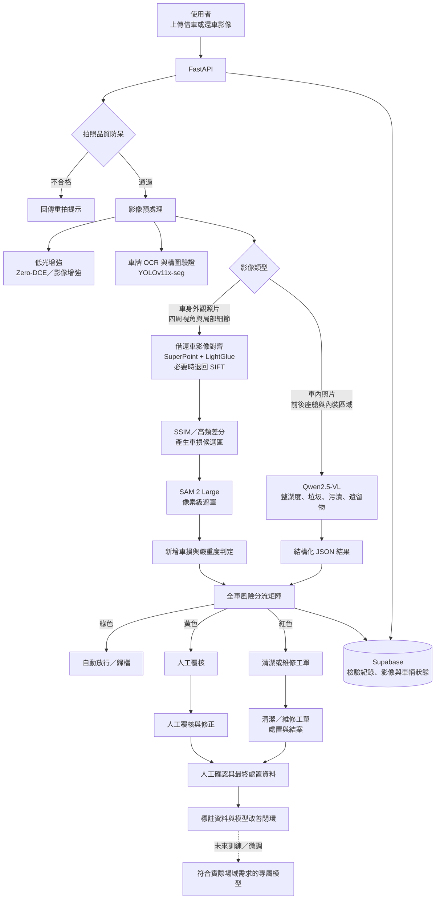

# iGuard

### iRent 智慧車況檢驗與營運分流平台

iGuard 是一套面向共享租車與車隊營運場景的 AI 車況檢驗平台，將影像品質檢查、車外車損比對、車內整潔判讀、風險分流、資料留存與工單管理整合成單一流程。

> **線上展示**：[開啟 iGuard Web Demo](https://happy123903.github.io/iGuard-Platform/)

> **專案定位**
> iGuard 目前是以通用預訓練模型為核心的流程驗證與產品原型。系統展示的是一套可落地的「影像 → 判讀 → 分流 → 派工」方法，仍需透過後續場域資料累積、人工覆核與專屬模型訓練持續提升準確度與穩定性。

---

## 目錄

- [核心價值](#核心價值)
- [功能總覽](#功能總覽)
- [系統架構](#系統架構)
- [流程架構圖](#流程架構圖)
- [技術棧](#技術棧)
- [模型與方法](#模型與方法)
- [API 入口](#api-入口)
- [資料層](#資料層)
- [目前限制與模型現況](#目前限制與模型現況)
- [未來展望](#未來展望)
- [專案結構](#專案結構)

---

## 核心價值

傳統車況檢查通常依賴人工逐張查看，容易受到拍攝品質、環境光線、個人經驗與判定標準差異影響。iGuard 的設計重點不是單獨追求「辨識一張圖片」，而是建立一個能支援營運決策的完整閉環：

- **先防呆，再判讀**：在模型推理前檢查模糊、曝光、構圖與車牌等輸入條件。
- **借還車影像比對**：透過影像對齊與結構差異分析，找出可能的新增車損。
- **車外與車內分流處理**：車外關注車損，車內關注整潔、垃圾、污漬與遺留物。
- **AI 結果直接連接營運動作**：依風險分為自動放行、人工覆核、清潔或維修派工。
- **保留人工覆核入口**：讓低信心或高風險案件可以由營運人員確認，並累積未來訓練專屬模型所需的資料。

## 功能總覽

| 功能 | 說明 |
| --- | --- |
| 拍照品質防呆 | 以模糊度、亮度、曝光與九宮格均勻性檢查影像品質 |
| 構圖與車輛驗證 | 偵測車輛主體、估算佔比、產生車身遮罩並驗證拍攝視角 |
| 車牌辨識 | 透過 OCR 輔助車牌資訊核對 |
| 暗光增強 | 對地下室、夜間等低光影像進行增強或備援處理 |
| 車外車損檢驗 | 對齊借車／還車照片，分析新增差異並產生車損遮罩 |
| 車內整潔判讀 | 分析整潔等級、垃圾、污漬與疑似遺留私人物品 |
| 三色風險分流 | 綠色放行、黃色人工覆核、紅色阻擋預約並派工 |
| 工單與狀態管理 | 儲存檢驗證據、建立清潔／維修工單並追蹤狀態 |
| 管理端資料查詢 | 查詢檢驗紀錄、工單與車輛狀態 |

---

## 系統架構

### 前端

`frontend/` 採用靜態 HTML、CSS 與 JavaScript，提供：

- 車況影像上傳與拍照引導
- 檢驗結果與風險等級呈現
- 車輛狀態與工單資訊展示
- 管理端案件查詢

前端不負責模型推理，可部署於 GitHub Pages 或其他靜態網站託管服務。

### 後端與 AI 推理

`app/` 使用 FastAPI 提供本機推理 API，負責：

- 接收並驗證影像
- 執行品質防呆、影像前處理與模型推理
- 整合車外、車內與全車評估結果
- 產生風險分流與工單資料
- 將檢驗結果同步至資料庫與圖片儲存

### 資料層

系統可搭配 Supabase 使用：

- PostgreSQL：檢驗紀錄、工單、車輛狀態
- Storage：檢驗影像與診斷覆蓋圖
- Realtime：支援管理端即時更新
- Row Level Security：限制前端直接存取營運資料

---

## 流程架構圖



### 判定結果

| 等級 | 預設動作 | 適用情境 |
| --- | --- | --- |
| 🟢 **Green** | 自動歸檔／放行 | 未發現新增車損，且車內為 clean 或 fair |
| 🟡 **Yellow** | 人工覆核 | 輕度／中度車損或疑似遺留物 |
| 🔴 **Red** | 阻擋下一筆預約並派工 | 嚴重車損或車內嚴重髒亂 |

---

## 技術棧

| 分層 | 技術 |
| --- | --- |
| API | FastAPI、Uvicorn、Pydantic |
| 影像處理 | OpenCV、NumPy、Pillow、scikit-image |
| 視覺模型 | YOLOv11x-seg、SAM 2、SuperPoint、LightGlue |
| 多模態模型 | Qwen2.5-VL-3B-Instruct、Transformers、PyTorch |
| OCR | EasyOCR |
| 資料服務 | Supabase、PostgreSQL、Supabase Storage、Realtime |
| 前端 | HTML、CSS、JavaScript |
| 部署 | 本機 GPU 推理、GitHub Pages 靜態前端、可選 Cloudflare Tunnel |

---

## 模型與方法

| 模組 | 目前使用的模型／方法 | 主要用途 |
| --- | --- | --- |
| 品質檢查 | Laplacian、曝光與九宮格分析 | 判斷影像是否適合進入後續推理 |
| 車輛構圖 | YOLOv11x-seg 預訓練權重 | 車輛偵測、車身遮罩與構圖驗證 |
| 影像對齊 | SuperPoint + LightGlue；必要時退回 SIFT | 對齊不同時間拍攝的借車與還車影像 |
| 車損候選區 | SSIM、高頻差分、輪廓與像素篩選 | 找出可能的新增差異 |
| 車損遮罩 | SAM 2 Large 預訓練權重 | 產生像素級遮罩、計算損傷區域與面積 |
| 車內判讀 | Qwen2.5-VL-3B-Instruct | 分析整潔度、垃圾、污漬與遺留物 |
| 風險分流 | 規則式三色決策矩陣 | 將模型結果轉為營運動作 |

---

## API 入口

| 方法 | 路徑 | 用途 |
| --- | --- | --- |
| `GET` | `/health` | 查詢服務與 GPU 狀態 |
| `POST` | `/api/v1/guard/check` | 執行拍照品質與構圖防呆 |
| `POST` | `/api/v1/exterior/inspect` | 比對借車／還車影像並檢測車損 |
| `POST` | `/api/v1/interior/inspect` | 分析車內整潔度與物品 |
| `POST` | `/api/v1/dispatch/evaluate` | 執行三色風險分流 |
| `POST` | `/api/v1/vehicle/evaluate` | 進行全車綜合評估 |
| `GET` | `/api/v1/inspections` | 查詢檢驗紀錄 |
| `GET` | `/api/v1/work-orders` | 查詢工單 |
| `PATCH` | `/api/v1/work-orders/{work_order_id}` | 更新工單狀態 |
| `GET` | `/api/v1/vehicles` | 查詢車輛狀態 |

完整參數與 request／response schema 請啟動服務後查看 Swagger。

---

## 資料層

### Supabase Schema

資料表定義位於 [`supabase/schema.sql`](supabase/schema.sql)，包含：

- `inspections`：檢驗案件與模型結果
- `work_orders`：清潔／維修工單
- `vehicles`：車輛狀態與基本資料
- `capture_scores`：使用者拍照品質統計

---

## 目前限制與模型現況

目前深度學習模型皆為既有的通用預訓練權重，尚未使用本競賽 dataset 的完整車損標註資料進行領域微調或重新訓練。因此，模型在特定車款、拍攝角度、光線環境與車損型態上的預測結果可能不如預期。

主要限制包括：

- 反光、陰影、拍攝位移與壓縮雜訊可能被差分流程誤認為新增車損。
- 細小或低對比刮痕可能被漏判。
- SAM 2 是通用分割模型，不是專門的車損分類器。
- Qwen2.5-VL 對日常使用痕跡與必須派工的髒污界線，可能受到視角與提示詞影響。
- 車損位置、嚴重度、舊傷／新傷與清潔標準具有主觀性。
- 目前的閾值與三色規則可支援流程執行，但不等同於經人工專家一致驗證的評分標準。

因此，現階段輸出應視為**輔助判讀、案件篩選與流程驗證結果**，不應直接作為專業估價、事故責任或法律判定的唯一依據。

在缺少可靠 ground truth 的情況下，直接訓練專屬模型可能只是把不一致的主觀判斷學進模型。考量車損標註耗時、主觀性高，且競賽 dataset 未提供完整車損 label 資源，現階段採用預訓練模型搭配影像防呆、跨時間比對、規則篩選與人工覆核，是較務實的選擇。

---

## 未來展望

1. **建立高品質標註資料集**：制定車損位置、類型、面積、嚴重度與新增損傷的標註規範，採用雙人標註與專家仲裁降低主觀差異。
2. **訓練符合實際場域需求的專屬模型**：累積足夠資料後，針對 iRent 車款、拍攝規格與常見損傷型態進行微調或重新訓練。
3. **建立人機協作閉環**：將黃色案件的模型預測、人工修正、最終處置與工單結果回寫為訓練資料。
4. **提升多視角與時間序列比對**：整合同一車輛的多角度影像、歷史損傷與借還車紀錄，降低單張照片造成的誤判。
5. **強化生產環境能力**：加入模型版本管理、推理延遲監控、資料品質監控與模型表現分群分析。

最終目標不是完全取代人工，而是讓 AI 處理高頻且可標準化的初步檢驗，讓人員將時間集中於高風險、低信心與需要專業判斷的案件。

---

## 專案結構

```text
iGuard-Platform/
├── app/
│   ├── guard/              # 品質、構圖、車牌與低光處理
│   ├── engine/             # 車損、車內、對齊與分流引擎
│   ├── main.py             # FastAPI 服務入口
│   ├── database.py         # Supabase 資料存取
│   ├── gpu_manager.py      # GPU 與模型生命週期管理
│   └── schemas.py          # Pydantic API schema
├── benchmark/              # 批次評估與報告工具
├── config/                 # GPU 與推理閾值設定
├── frontend/               # 使用者端與管理端靜態頁面
├── models/                 # 模型權重說明與本機權重
├── outputs/                # 推理輸出與暫存影像
├── supabase/               # PostgreSQL schema
├── .env.example            # 環境變數範本
└── README.md
```
